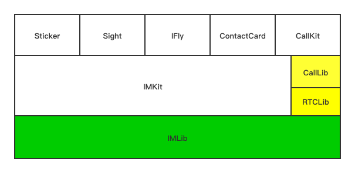

# 一. 简介

## 1.目标说明

**为了让开发者可以通过 pod 进行 `framework` 和 `源码` 两种形式切换，融云 UI SDK 以 pod 方式开源**

**依赖现有的 `RongCloudIM` 与 `RongCloudRTC` 两个 pod， 增加一个新的 pod 仓库 `RongCloudOpenSource`**

RongCloudIM 和 RongCloudRTC 里面 SDK 都以 framework 形式存在

RongCloudOpenSource 里面 SDK 都以源码形式存在，主要包含各个 UI SDK 的源码


```
警告：
建议开发者参考我们各个 UI SDK 的源码实现，以继承方式，在子类中重写父类方法实现自定义相关功能
强烈不建议直接修改 SDK 源码，避免后续版本升级导致修改被重置
```

**·注：RongCloudOpenSource 的发布时间为 RongCloudIM 和 RongCloudRTC 发布之后的一到两个工作日**

## 2. 架构说明



**此处有架构图，如果空白或者加载失败，请查看 images/pod_ui_arch.png**

**绿色部分的 SDK 是以 `framework` 形式存在，属于 RongCloudIM**

**黄色部分的 SDK 是以 `framework` 形式存在，属于 RongCloudRTC**

**白色部分的 SDK 是以 `源码` 形式存在，只属于 RongCloudOpenSource**


podfile 引入 RongCloudOpenSource 默认就可以引入这些 SDK

名称| 可选与否|含义
:---|:---|:---
IMKit|可选|IM UI 能力库，含会话列表页面，会话页面，输入工具栏
Sticker|可选|表情 SDK
Sight|可选|小视频 SDK
IFly|可选|语音输入 SDK
ContactCard|可选|名片 SDK
CallKit|可选|音视频 UI 库

## 3. 引入方式说明

支持 framework 和 源码 两种引入方式

`说明：本文档涉及的 SDK 仅能两种形式存在，即全是源码，或者全是 framework`，不能出现一部分源码，一部分 framework（如不支持 IMKit 使用源码而 CallKit 使用 framework）

如果需要在 framework 和 源码两种方式之间切换需要涉及 podfile 的声明 和 APP 项目的引入问题，可以参见下面的内容

### 3.1 引入 framework

> podfile

```
pod 'RongCloudIM/IMKit','5.0.0'           # IMKit
pod 'RongCloudIM/Sight','5.0.0'           # 小视频
pod 'RongCloudIM/RongSticker','5.0.0'     # 表情
pod 'RongCloudIM/LocationKit', 5.2.3'	  # 地图Kit 注意：5.2.3(含)版本以后才支持 pod

pod 'RongCloudRTC/RongCallKit','5.0.0'    # CallKit
```

> 项目 import

```
#import <RongIMKit/RongIMKit.h>
#import <RongSight/RongSight.h>
```

### 3.2 引入源码

> podfile

```
pod 'RongCloudOpenSource/IMKit','5.0.0'           # IMKit
pod 'RongCloudOpenSource/Sight','5.0.0'           # 小视频
pod 'RongCloudOpenSource/RongSticker','5.0.0'     # 表情
pod 'RongCloudOpenSource/IFly','5.0.0'            # 语音输入
pod 'RongCloudOpenSource/ContactCard','5.0.0'     # 名片
pod 'RongCloudOpenSource/LocationKit','5.2.3'     # 地图Kit 注意：5.2.3(含)版本以后才支持 pod

pod 'RongCloudOpenSource/RongCallKit','5.0.0'     # CallKit
```

> 项目 import

```
#import <RongCloudOpenSource/RongIMKit.h>
#import <RongCloudOpenSource/RongSight.h>
```

## 4. 名片插件特殊说明

### 5.1.8(不含)以前版本
名片插件，没有以 framework 形式推到 pod，如果需要使用名片 SDK，建议使用源码方式导入
> podfile

```
pod 'RongCloudOpenSource/ContactCard','5.0.0' 
```

如果必须使用名片的 framework，那么请在 [SealTalk 源码](https://github.com/rongcloud/sealtalk-ios/tags)中找到对应版本的 tag，下载源码压缩包解压后，找到(工程路径为 ios-sealtalk/framework/RongContactCard)中的名片 SDK 并手动导入，并将 xcframework 的 Embed 设置为 Embed & Sign

### 5.1.8(含)以后版本
名片插件，已支持以 framework 形式推到 pod， 集成方式任选以下两种之一
> podfile

```
pod 'RongCloudIM/ContactCard','5.1.8'			#framework
pod 'RongCloudOpenSource/ContactCard','5.0.0' 	#源码
```

## 5. 讯飞语音输入插件特殊说明

[讯飞语音输入插件](./ifly.md)

## 6. FAQ

> 找不到 RongCloudOpenSource 怎么办？

终端执行 pod repo update 即可
